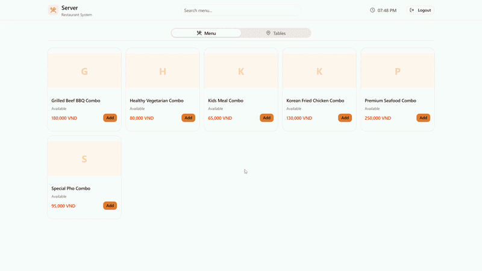
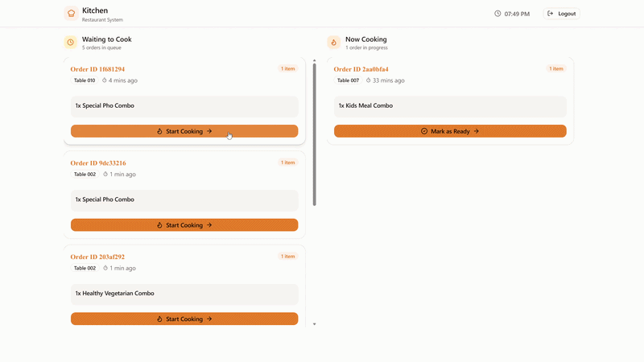
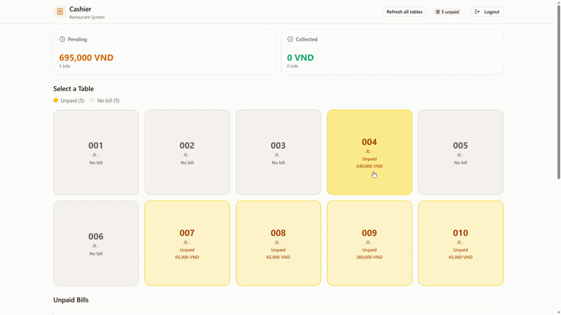
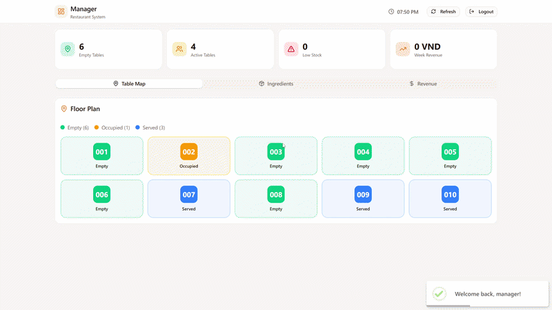

# Restaurant Management System

A comprehensive, full-stack Restaurant Management System built with a Node.js/Express backend and a React frontend. The application features an event-driven domain architecture, role-based access control, and specialized dashboards for every role in a modern restaurant environment.

## 📸 Demo Media

### Server Device (Placing Order)


### Kitchen Display System (Order Queue)


### Cashier Dashboard (Billing)


### Manager Dashboard (Inventory & Analytics)


---

## 🏗 System Architecture

The application is split into two primary components: a scalable **Backend** and a modern **Frontend**.

### 🔧 Backend

The backend is a Node.js REST API built with Express, TypeScript, and PostgreSQL. It leverages an **Event-Driven Domain-Driven Design (DDD)**. 

Instead of tight coupling, modules communicate via a lightweight, in-memory `EventBus`. For example, when an order is created, an `ORDER_CREATED` event is emitted. The Kitchen module listens to this and automatically generates a kitchen ticket, while the Inventory module listens and deducts the raw materials used.

**Tech Stack:**
- **Runtime:** Node.js 20.x
- **Language:** TypeScript
- **Framework:** Express
- **Database:** PostgreSQL 16 (`pg` driver, raw queries)
- **Authentication:** JWT (`jsonwebtoken`) & bcryptjs

**Core Modules:**
- **Auth:** Handles JWT issuance and role-based access control.
- **Table:** Manages dining table statuses (`available`, `occupied`, `food_ready`).
- **Kitchen:** Manages kitchen tickets and cooking workflows.
- **Billing:** Handles payment processing and bill generation.
- **Inventory:** Tracks raw ingredients and automatically deducts stock upon order creation. Emits warnings when stock is low.
- **Analytics:** Tracks daily revenue and user management.
- **Order:** Manages menu items, availability, and the central ordering process.

#### Backend Setup

1. Navigate to the `backend` directory:
   ```bash
   cd backend
   ```
2. Install dependencies:
   ```bash
   npm install
   ```
3. Set up your PostgreSQL database and run the schema file:
   ```bash
   psql -U postgres -d RestaurantSystem -f ../db/RestaurantSystem.sql
   ```
4. Create a `.env` file (see `.env.example` for required variables).
5. Start the development server:
   ```bash
   npm run dev
   ```

### 💻 Frontend

The frontend is a robust Single Page Application (SPA) providing tailored UI experiences for each specific role in the restaurant.

**Tech Stack:**
- **Framework:** React + TypeScript
- **Bundler:** Vite
- **Styling:** CSS / TailwindCSS
- **Routing:** React Router

**Features:**
- **Role-Based Routing:** Users are restricted to their specific pages (e.g., chefs can only access the Kitchen Display System, cashiers only access Billing).
- **Real-Time Dashboards:** Instant feedback and status updates for orders and tickets.
- **Responsive Design:** Optimized for tablets (servers taking orders) and desktop terminals (cashiers/managers).

#### Frontend Setup

1. Navigate to the `frontend` directory:
   ```bash
   cd frontend
   ```
2. Install dependencies:
   ```bash
   npm install
   ```
3. Start the development server:
   ```bash
   npm run dev
   ```

---

## 👥 Default Accounts

The database seed provides the following default accounts.

| Role | Username | Password |
| :--- | :--- | :--- |
| **Admin** | `admin` | `admin123` |
| **Manager** | `manager` | `manager123` |
| **Server** | `server` | `server123` |
| **Chef** | `chef` | `chef123` |
| **Cashier** | `cashier` | `cashier123` |

---

## 🚀 Future Enhancements
- Replace the in-memory EventBus with a robust message broker (e.g., RabbitMQ or Redis Pub/Sub) for multi-instance scaling.
- Integrate WebSockets (Socket.io) for real-time frontend updates (e.g., instantly notifying the server when the kitchen finishes a ticket).
- Add automated unit and integration testing.
